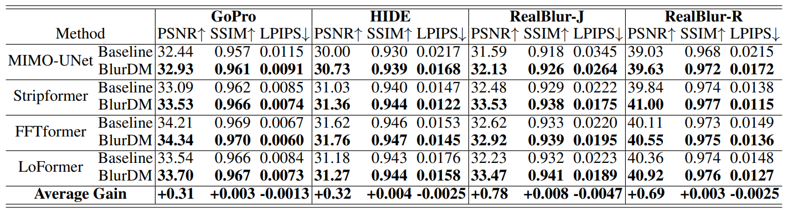

# BlurDM: A Blur Diffusion Model for Image Deblurring (NeurIPS 2025)
Jin-Ting He, Fu-Jen Tsai, Yan-Tsung Peng, Min-Hung Chen, Chia-Wen Lin, Yen-Yu Lin
> Diffusion models show promise for dynamic scene deblurring; however, existing studies often fail to leverage the intrinsic nature of the blurring process within diffusion models, limiting their full potential. To address it, we present a Blur Diffusion Model (BlurDM), which seamlessly integrates the blur formation process into diffusion for image deblurring. Observing that motion blur stems from continuous exposure, BlurDM implicitly models the blur formation process through a dual-diffusion forward scheme, diffusing both noise and blur onto a sharp image. During the reverse generation process, we derive a dual denoising and deblurring formulation, enabling BlurDM to recover the sharp image by simultaneously denoising and deblurring, given pure Gaussian noise conditioned on the blurred image as input. Additionally, to efficiently integrate BlurDM into deblurring networks, we perform BlurDM in the latent space, forming a flexible prior generation network for deblurring. Extensive experiments demonstrate that BlurDM significantly and consistently enhances existing deblurring methods on four benchmark datasets.


## Installation
```
conda create -n IDBlau python=3.9
conda activate IDBlau
conda install pytorch==1.13.1 torchvision==0.14.1 torchaudio==0.13.1 pytorch-cuda=11.7 -c pytorch -c nvidia
pip install opencv-python tqdm tensorboardX pyiqa thop numpy pandas
```

## Dataset Preparation
Download dataset from following links:

[GoPro](<https://seungjunnah.github.io/Datasets/gopro.html>)

[HIDE](<https://github.com/joanshen0508/HA_deblur?tab=readme-ov-file>)

[RealBlur](<https://cg.postech.ac.kr/research/realblur/>)

The data folder should be like the format below:
'''
GOPRO
├─ train
│  ├─ video1    % 2103 image pairs
│  │  ├─ blur
│  │  │  ├─ xxxx.png
│  │  │  ├─ ......
│  │  ├─ sharp
│  │  │  ├─ xxxx.png
│  │  │  ├─ ......
│  │
│  ├─ video2
│  │  ├─ blur
│  │  │  ├─ xxxx.png
│  │  │  ├─ ......
│  │  ├─ sharp
│  │  │  ├─ xxxx.png
│  │  │  ├─ ......
│
├─ test    % 1111 image pairs
│  ├─ ...... (same structure as train)
'''

## Training
For each backbone, run the training scripts **in order**:

1. `train_stage1.py`
2. `train_stage2.py`
3. `train_stage3.py`

**Notes:**
- In `train_stage2.py`, load the **Encoder weights** trained in **Stage 1**.
- In `train_stage3.py`, load both:
  - the **deblurring backbone weights** pretrained in **Stage 1**, and
  - the **BlurDM weights** trained in **Stage 2**.

## Testing
You can load your **trained weights** and run `python deblur_predict.py` or `torchrun deblur_predict_ddp.py` to evaluate on the test sets of each dataset.

Our trained weights is upcomming.
<!-- or download **our trained weights for each backbone** from [this link](<https://drive.google.com/drive/folders/144ntonNrjf_rjiDJQduzi9_5XhHI2TB-?usp=sharing>).   -->
<!-- Then run `python deblur_predict.py` or `torchrun deblur_predict_ddp.py` to evaluate on the test sets of each dataset. -->

**Important:**
- In `deblur_predict.py` and `deblur_predict_ddp.py`, set the correct **path to the trained weights**.
- Also set the **dataset paths** before running.

## Results



## Acknowledgement
The utils is is built upon [BasicSR](<https://github.com/XPixelGroup/BasicSR>).
## Citation
```
@inproceedings{heblurdm,
  title={BlurDM: A Blur Diffusion Model for Image Deblurring},
  author={He, Jin-Ting and Tsai, Fu-Jen and Peng, Yan-Tsung and Chen, Min-Hung and Lin, Chia-Wen and Lin, Yen-Yu},
  booktitle={The Thirty-ninth Annual Conference on Neural Information Processing Systems}
}
```