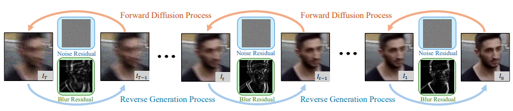
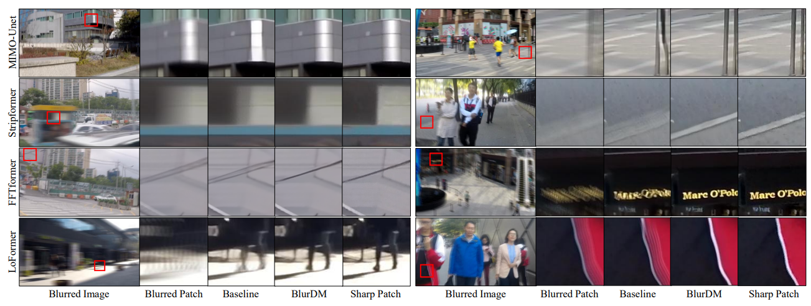
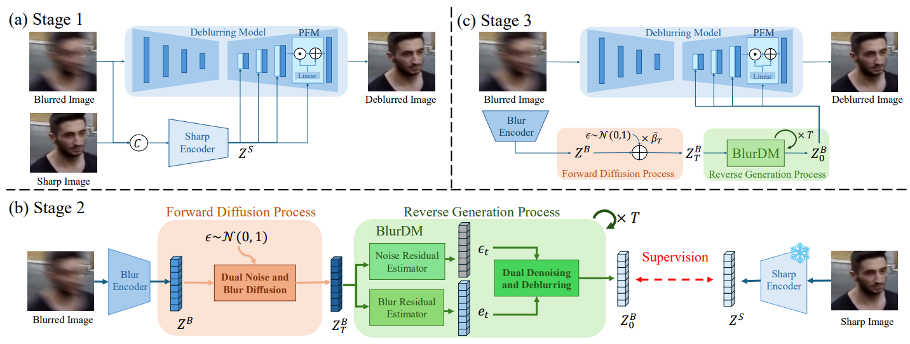

## Abstract
Diffusion models show promise for dynamic scene deblurring; however, existing studies often fail to leverage the intrinsic nature of the blurring process within diffusion models, limiting their full potential. To address it, we present a Blur Diffusion Model (BlurDM), which seamlessly integrates the blur formation process into diffusion for image deblurring. Observing that motion blur stems from continuous exposure, BlurDM implicitly models the blur formation process through a dual-diffusion forward scheme, diffusing both noise and blur onto a sharp image. During the reverse generation process, we derive a dual denoising and deblurring formulation, enabling BlurDM to recover the sharp image by simultaneously denoising and deblurring, given pure Gaussian noise conditioned on the blurred image as input. Additionally, to efficiently integrate BlurDM into deblurring networks, we perform BlurDM in the latent space, forming a flexible prior generation network for deblurring. Extensive experiments demonstrate that BlurDM significantly and consistently enhances existing deblurring methods on four benchmark datasets.

## Results

We provide qualitative comparisons of four baselines and their BlurDM-enhanced versions on the GoPro and HIDE test sets in this figure. The results show that BlurDM consistently produces sharper and more visually appealing deblurred results than "Baseline."

We compare the deblurring performance of four baselines and their BlurDM-enhanced versions, where “Baseline” and “BlurDM” refer to the deblurring performance without and with BlurDM, respectively. The results indicate that BlurDM consistently and significantly enhances deblurring performance.

## Overview

We progressively add both noise and blur to a sharp image through a dual noise and blur diffusion process during forward diffusion. In the reverse process, BlurDM jointly denoises and deblurs the image, starting from Gaussian noise conditioned on the blurred input. 

We use BlurDM as a prior generation network to retain the diffusion model’s ability to learn high-quality, realistic image content while embedding the learned prior into the latent space of a deblurring network for effective and high-fidelity restoration.


## Citation
```
@inproceedings{heblurdm,
  title={BlurDM: A Blur Diffusion Model for Image Deblurring},
  author={He, Jin-Ting and Tsai, Fu-Jen and Peng, Yan-Tsung and Chen, Min-Hung and Lin, Chia-Wen and Lin, Yen-Yu},
  booktitle={The Thirty-ninth Annual Conference on Neural Information Processing Systems}
}
```
